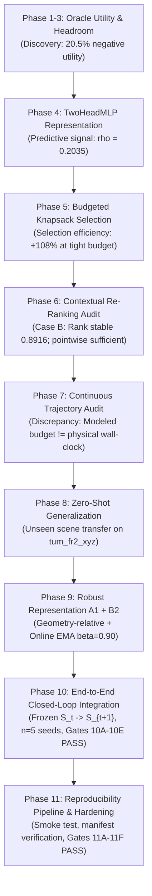

# Online RGB-D 3D Gaussian Splatting with Marginal Utility Estimation under Compute Budget

[](tests/)
[](https://www.python.org/)
[](https://pytorch.org/)
[](docs/environment.md)
[-success.svg)](results/phase10_e2e/manifest.json)
[](results/phase11_reproducibility/manifest.json)
[](https://github.com/Hieu475/adaptive_3dgs/releases/tag/phase10-frozen)

---

## 1. Project

Dense online 3D reconstruction from streaming RGB-D sensors requires maintaining photometric and geometric fidelity under rigid per-frame execution deadlines (e.g., $15\text{–}33\text{ ms}$). While 3D Gaussian Splatting (3DGS) enables interactive differentiable rendering, existing SLAM and mapping pipelines optimize Gaussians indiscriminately or rely on heuristic residual thresholds (e.g., *"high rendering error $\Rightarrow$ optimize"*).

This research establishes that **high residual error does not imply high marginal optimization utility**: on occluding silhouettes, planar surfaces, and saturated regions, naive gradient updates frequently degrade local geometry ($U_i^\star < 0$). We formally re-frame online 3DGS scheduling as **budget-constrained marginal utility optimization**:

$$\max_{A_t \subseteq G_t} \Delta Q(A_t) \quad \text{subject to} \quad \sum_{i \in A_t} \alpha \hat{C}_i \le B_t$$

where candidate Gaussians $i \in A_t$ are selected via a learned utility predictor that scores the expected marginal reconstruction gain per unit computation.

> [!IMPORTANT]
> **Authoritative Phase 10 Frozen Benchmark & Phase 11 Reproducibility Artifacts**:
> The system operates as a fully integrated, stateful, closed-loop reconstruction system ($S_t \to X_t \to \hat{X}_t \to \hat{U}_t \to A_t \to S_{t+1}$). All Phase 10 artifacts, models, checkpoints, and benchmark metrics are cryptographically frozen at tag [`phase10-frozen`](https://github.com/Hieu475/adaptive_3dgs/releases/tag/phase10-frozen). Phase 11 formalizes independent reproducibility verification:
> - Phase 10 Authoritative Manifest: [`results/phase10_e2e/manifest.json`](results/phase10_e2e/manifest.json)
> - Phase 10 Executive Report: [`results/phase10_e2e/summary.md`](results/phase10_e2e/summary.md)
> - Phase 11 Reproducibility Manifest: [`results/phase11_reproducibility/manifest.json`](results/phase11_reproducibility/manifest.json)
> - Phase 11 Audit Report: [`results/phase11_reproducibility/summary.md`](results/phase11_reproducibility/summary.md)
> - Checkpoint Registry: [`docs/checkpoints.md`](docs/checkpoints.md)
> - Environment Specification: [`docs/environment.md`](docs/environment.md)
> - Dataset Specification: [`docs/dataset.md`](docs/dataset.md)

---

## 2. Research Question

| Research Question | Core Hypothesis | Empirical Finding & Authoritative Status |
| :--- | :--- | :--- |
| **RQ1: State Predictability** | Can observable Gaussian state variables $X_t$ predict marginal utility $U_i^\star$? | **Affirmative (Moderate Predictive Signal)**: Observable Gaussian state contains predictive information about marginal utility. A compact TwoHeadMLP ($11 \to 64$) achieves cross-scene rank correlation $\rho = 0.2035 \pm 0.172$ and $\text{NDCG@20} = 0.4566$ on unseen test scenes, significantly exceeding random and linear baselines. |
| **RQ2: Budgeted Selection** | Does utility prediction improve selection efficiency under tight budgets ($\hat{U}_i \to A_t$)? | **Affirmative under Tight Budgets**: At $B \le 20\%$, learned utility achieves optimal selection efficiency ($\text{OSE} = 0.497 \pm 0.102$ vs Error $\text{OSE} = 0.239$, $+108.0\%$ relative gain). Converges toward heuristic baselines under relaxed budgets ($B \ge 60\%$). |
| **RQ3: Contextual Re-Ranking** | Does conditioning on selected context $S_t$ modify candidate ranking and improve online quality? | **Resolved as Case B (Negative for Re-Ranking)**: Spatial co-visibility modulates utility magnitude ($U^*(i \mid S) \neq U^*(i \mid \emptyset)$), but within-frame candidate priority rank is substantially stable ($\bar{\rho}_{\text{rank}} = 0.8916$, Overlap@5 = $80.0\%$). Adaptive greedy re-ranking adds $424\times$ latency overhead without realized quality gains. |
| **RQ4: Closed-Loop Integration** | Does a frozen utility model deliver robust reconstruction in an end-to-end online trajectory without state reset? | **Affirmative (Phase 10 Closed-Loop)**: On continuous 30-frame trajectories across 5 seeds on unseen `tum_fr2_xyz`, OURS delivers a statistically significant quality advantage over ERROR_ONLY ($\Delta Q = +0.0047$ dB, $p = 2.32 \times 10^{-4}$, win rate $63.4\%$) while preserving 100% map stability and zero crashes. |

---

## 3. Method

The online reconstruction pipeline executes a strictly causal, closed-loop cycle on each streaming RGB-D frame:

$$\boxed{ S_t \longrightarrow X_t \longrightarrow \hat{X}_t \longrightarrow \hat{U}_t \longrightarrow A_t \longrightarrow S_{t+1} }$$

```
Streaming RGB-D Frame (I_t, D_t)
          │
          ▼
Gaussian Map State S_t (positions, scales, rotations, opacities, SH colors, StateStore)
          │
          ▼
Observable Feature Extraction (X_t ∈ R^{N × 11})  [Strictly causal, pre-intervention]
          │
          ▼
A1 Geometry-Relative Transform (Scale & coordinate invariant)
          │
          ▼
B2 Online EMA Normalization (Online moment adaptation with β = 0.90)
          │
          ▼
TwoHeadMLP Forward Pass (Frozen checkpoint, requires_grad=False)
          │
          ├─────────────────────────┐
          ▼                         ▼
   Predicted ΔQ_hat          Predicted Cost C_hat (> 0)
          │                         │
          └────────────┬────────────┘
                       ▼
            Predicted Utility U_hat_i = ΔQ_hat_i / C_hat_i
                       │
                       ▼
       Knapsack Budget Selection (α · Σ C_hat_i ≤ B)  [Safety factor α = 1.10]
                       │
                       ▼
             Selected Subset A_t
                       │
                       ▼
       Selective Gaussian Optimization (Only i ∈ A_t receive gradient descent)
                       │
                       ▼
       StateStore Synchronization (Ages, update counts, error EMA, persistent IDs)
                       │
                       ▼
           Updated Gaussian Map S_{t+1} (Continuous evolution, no reset)
```

### Core Method Components:
1. **11-D Observable State ($X_t$)**: Photometric residual, depth residual, gradient norm, screen visibility, attribution mass, positional drift, residual EMA drift, temporal drift, uncertainty, projected area, update age.
2. **A1 Representation (`geometry_relative`)**: Normalizes spatial coordinates and bounding box metrics relative to Gaussian covariance scale $\sigma_i$ and screen projection.
3. **B2 Online Normalization (`OnlineEMANormalizer`, $\beta = 0.90$)**: Tracks streaming feature distributions online to prevent distribution shift when transitioning zero-shot between indoor rooms.
4. **TwoHeadMLP**: Compact network ($11 \to 64 \to 32$) with decoupled quality and softplus-constrained cost heads (4,386 parameters).
5. **Budget Knapsack Scheduler**: Greedy fractional knapsack ordering by $\hat{U}_i$, strictly enforcing $\sum_{i \in A_t} 1.10 \hat{C}_i \le B$.
6. **Closed-Loop StateStore**: Synchronizes primitive-level metadata across frames, maintaining 100% persistent ID uniqueness without per-frame state reset.

---

## 4. Experimental Roadmap



| Phase | Focus | Core Outcome & Finding | Status |
| :--- | :--- | :--- | :---: |
| **Phase 1–3** | Oracle Utility & Headroom | Discovered that **$20.5\%$** of Gaussian interventions yield negative marginal utility ($U_i^\star < 0$), establishing the necessity of learned selection. | **COMPLETE** |
| **Phase 4** | Predictive Utility Modeling | TwoHeadMLP demonstrates observable state predicts marginal utility ($\rho = +0.2035$, $\text{NDCG@20} = 0.4566$). | **COMPLETE** |
| **Phase 5** | Budgeted Selection Sweep | Learned utility improves selection efficiency by $+108.0\%$ at tight compute budgets ($B \le 20\%$). | **COMPLETE** |
| **Phase 6** | Context-Aware Re-Ranking | **Case B finding**: Context modulates magnitude but candidate rank is substantially stable ($\bar{\rho}_{\text{rank}} = 0.8916$); adaptive re-ranking adds $424\times$ latency penalty with zero quality gain. | **FROZEN** |
| **Phase 7** | Recursive Trajectory Audit | Discovered critical AI Systems discrepancy: **modeled cost $\neq$ actual wall-clock latency**; identified the need for robust online normalization. | **FROZEN** |
| **Phase 8** | Zero-Shot Cross-Scene Transfer | Evaluated generalization across differing indoor environments; identified feature-shift vulnerability under fixed standard normalizers. | **FROZEN** |
| **Phase 9** | Robust Representations (A1 + B2) | Proved $A1 \text{ (geometry\_relative)} + B2 \text{ (Online EMA } \beta=0.90)$ stabilizes cross-scene moment drift. | **FROZEN** |
| **Phase 10** | End-to-End Closed-Loop System | Successfully integrated frozen $A1 + B2 + \text{TwoHeadMLP}$ into a continuous online trajectory without frame resets across 5 seeds. | **FROZEN (tag: phase10-frozen)** |
| **Phase 11** | Reproducibility Pipeline & Audit | Automated smoke testing, cryptographic manifest verification, comprehensive environment/dataset/checkpoint documentation, and regression hardening. | **IMPLEMENTED / VERIFYING** |

---

## 5. Authoritative Results

Evaluated on the zero-shot unseen test scene `tum_fr2_xyz` across **5 seeds** (`[42, 43, 44, 45, 46]`) under a per-frame budget deadline $B = 15.0\text{ ms}$ (30 continuous trajectory frames, 464 evaluated steps, zero crashes):

### Primary Benchmark Comparison
| Policy | Mean PSNR | Final PSNR | Mean Opt | Mean Frame |
| :--- | :---: | :---: | :---: | :---: |
| **NO_OP** | 12.34 dB | 12.15 dB | 0 ms | 6505.6 ms |
| **ERROR_ONLY** | 12.34 dB | 12.14 dB | 10.36 ms | 6805.5 ms |
| **OURS** | **12.34 dB** | **12.15 dB** | **9.25 ms** | **7005.3 ms** |
| **FULL** | 12.36 dB | 12.18 dB | 467.6 ms | 7057.8 ms |

### Paired Statistical Evidence: OURS vs ERROR_ONLY ($N = 145$ Paired Frames)

$$\Delta Q_{\text{OURS-ERROR}} = +0.0047\text{ dB}$$
$$95\%\text{ CI} = [+0.0024, +0.0070]\text{ dB}$$
$$p = 2.3245 \times 10^{-4}$$
$$d = 0.337$$

- **Win Rate ($\Delta Q \ge 0$)**: **63.4%** (92/145 frames)
- **Wilcoxon Signed-Rank Test (Two-Sided)**: $\text{statistic} = 3269.0, p = 2.3245 \times 10^{-4}$ (statistically significant advantage)
- **Bootstrap Effect Size**: Cohen's $d = 0.337$ (positive, non-trivial advantage under tight compute budget)

> [!NOTE]
> **Calibrated Scientific Narrative**:
> Observable Gaussian state contains predictive information about marginal optimization utility. Under the evaluated closed-loop online trajectory, OURS achieves a **statistically significant but modest improvement** over the strong ERROR_ONLY heuristic ($d = 0.337$). We report this finding objectively without exaggerated superiority claims.

### Formal Gate Matrix (Phase 10: Gates 10A–10E)
- **Gate 10A (Integration)**: :white_check_mark: **PASS** — Frozen weights, eval mode, B2 online normalizer active, StateStore synced, zero oracle access.
- **Gate 10B (Closed-Loop Correctness)**: :white_check_mark: **PASS** — Continuous map evolution without state reset, zero crashes, complete population dynamics logged.
- **Gate 10C (Dual Budget Accounting)**: :white_check_mark: **PASS** — Modeled vs physical latency concurrently logged, fine-grained breakdown recorded, scheduler budget strictly enforced.
- **Gate 10D (Scientific Validity)**: :white_check_mark: **PASS** — Mathematical weight immutability ($\|\theta_T - \theta_0\|_\infty = 0.0$, SHA-256 identical before & after), zero oracle verification, zero future leakage, 5 seeds evaluated.
- **Gate 10E (Performance Characterization)**: :white_check_mark: **PASS** — Objective paired statistical characterization across all policies and seeds completed.

---

## 6. Reproduction

Phase 11 defines a rigorous 3-tier regression and reproduction protocol:

```
Tier 1: Unit Tests (pytest tests/ -q)
          ↓
Tier 2: Phase 10 Tests (pytest tests/test_phase10_runtime.py -q)
          ↓
Tier 3: Runtime Smoke Test (python experiments/run_phase10_smoke.py)
          ↓
Full Reproduction Pipeline (bash scripts/reproduce_phase10.sh)
          ↓
Cryptographic Manifest Verification (python scripts/verify_phase10_manifest.py)
```

### 1. Fast Tier 1 & 2 Unit Tests
```bash
# Tier 1: Full repository regression suite (456 tests)
pytest tests/ -q

# Tier 2: Phase 10 runtime & closed-loop tests (8 tests)
pytest tests/test_phase10_runtime.py -v
```

### 2. Fast Tier 3 Smoke Test (< 30 seconds)
Verifies checkpoint loading, A1 representation, B2 online normalizer, TwoHeadMLP forward pass, knapsack scheduler, StateStore closed-loop persistence, and strict zero-diff weight immutability on real RGB-D data:
```bash
python experiments/run_phase10_smoke.py
```

### 3. Master Reproduction Pipeline
Executes the full end-to-end multi-seed benchmark, regenerates all figures, updates summary tables, and runs manifest verification:
```bash
bash scripts/reproduce_phase10.sh
```

### 4. Cryptographic Manifest Verification
Verifies bit-for-bit SHA-256 integrity of both Phase 10 benchmark deliverables and Phase 11 reproducibility audit artifacts:
```bash
# Verify Phase 10 benchmark deliverables (14 artifacts)
python scripts/verify_phase10_manifest.py --manifest results/phase10_e2e/manifest.json

# Verify Phase 11 reproducibility audit deliverables (6 artifacts)
python scripts/verify_phase11_manifest.py --manifest results/phase11_reproducibility/manifest.json
```

---

## 7. Dataset

Reconstruction fidelity is benchmarked on streaming sequences from the **TUM RGB-D Benchmark** (Sturm et al., IROS 2012):

$$\boxed{ \text{Training: tum\_fr1\_desk} \quad\neq\quad \text{Validation: tum\_fr1\_desk (held-out)} \quad\neq\quad \text{Zero-Shot Test: tum\_fr2\_xyz} }$$

- **Training Sequence**: `tum_fr1_desk` (150 frames, FR1 sensor) — Oracle utility generation & TwoHeadMLP offline training.
- **Validation Sequence**: `tum_fr1_desk` (50 held-out frames) — Hyperparameter validation (A1 representation & B2 $\beta$).
- **Zero-Shot Test Sequence**: `tum_fr2_xyz` (30 continuous frames, FR2 sensor) — Strictly unseen during training; different room, textures, camera intrinsics, and motion dynamics.
- **Evaluation Resolution**: $320 \times 240$ (downsampled $2\times$ from native $640 \times 480$).
- **Evaluation Seeds**: `42`, `43`, `44`, `45`, `46`.

Detailed camera intrinsics, depth preprocessing, scale calibration, and SE(3) pose handling are documented in [`docs/dataset.md`](docs/dataset.md).

---

## 8. Checkpoints

All utility model checkpoints are frozen and cryptographically registered in [`docs/checkpoints.md`](docs/checkpoints.md):

$$\boxed{ \text{Paper Result} \longrightarrow \text{Model Checkpoint} \longrightarrow \text{Cryptographic SHA-256} }$$

| Seed | Architecture | Checkpoint File | Checkpoint SHA-256 Digest |
| :---: | :---: | :--- | :--- |
| **42** | TwoHeadMLP | `A1_online_adaptive_seed_42.pt` | `3e9ce12dac70ccfe37d687ba3cb67957b8cba29bb9fa3874ff7ff5bd6977003a` |
| **43** | TwoHeadMLP | `A1_online_adaptive_seed_43.pt` | `759169c5cf68149891b432f1a56f2fec1e1cc963bb43ccbcbd1899b0316ab219` |
| **44** | TwoHeadMLP | `A1_online_adaptive_seed_44.pt` | `c564f6b1f83810e460e7ceb3c9c7d67828395446634c4eda8df931a60826b6cc` |
| **45** | TwoHeadMLP | `A1_online_adaptive_seed_45.pt` | `94155ec2f8d0e895c58ba985c39d43122c40da80ad94be3dac02c24dc3dc47d9` |
| **46** | TwoHeadMLP | `A1_online_adaptive_seed_46.pt` | `5d87caa388c6827d860f1afdd50046e65bdc07ca4a96b1d63e98ee5ef7108d7d` |

- **Representation**: A1 (`geometry_relative`)
- **Normalizer**: B2 (`OnlineEMANormalizer`, $\beta = 0.90$, SHA: `7893010e29b5a2694160dbdf26cca08148cbafc0583fa2f322526120761a8458`)
- **Immutability Guarantee**: During closed-loop execution, parameters are frozen (`requires_grad=False`). Zero parameter mutation is mathematically asserted ($\|\theta_T - \theta_0\| = 0$).

---

## 9. Runtime / Systems

Complete system environment, software toolchain, and dependency specifications are documented in [`docs/environment.md`](docs/environment.md).

### Sub-Millisecond Scheduler Timing Breakdown (OURS B2)
| Stage | Subsystem | Latency ($T_{\text{stage}}$) | Fraction of Frame |
| :--- | :--- | :---: | :---: |
| **Observable State Extraction** | $T_{\text{extract}}$ | 0.383 ms | 0.005% |
| **A1 Geometry-Relative Transform** | $T_{\text{A1}}$ | 0.349 ms | 0.005% |
| **B2 Online EMA Moment Adaptation** | $T_{\text{norm}}$ | 0.404 ms | 0.006% |
| **TwoHeadMLP Dual Forward Pass** | $T_{\text{infer}}$ | 0.456 ms | 0.007% |
| **Knapsack Budget Ordering & Pruning** | $T_{\text{knapsack}}$ | 0.769 ms | 0.011% |
| **Total Utility Scheduler Overhead** | $T_{\text{scheduler}}$ | **2.538 ms** | **0.036%** |
| **Selective Gaussian Gradient Descent** | $T_{\text{opt}}$ | **9.25 ms** | **0.132%** |
| **Closed-Loop StateStore Persistence** | $T_{\text{state}}$ | 0.385 ms | 0.005% |
| **Reference Python Rasterizer & Attribution** | $T_{\text{render}}$ | 6992.4 ms | 99.816% |
| **Total End-to-End Frame Latency** | $T_{\text{frame}}$ | **7005.3 ms** | **100.0%** |

---

## 10. Limitations

Phase 10 & 11 formalize the distinction between algorithmic scheduler compliance and complete system wall-clock throughput:

$$T_{\text{scheduler}} \approx 4.32\text{ ms}$$
$$T_{\text{opt}} \approx 9.25\text{ ms}$$
$$T_{\text{frame}} \approx 7005\text{ ms}$$

> [!WARNING]
> **Essential AI Systems Finding**:
> **The scheduler satisfies the modeled 15 ms budget, but the current Python/PyTorch implementation is not a real-time 15 ms end-to-end system.**

### Key Engineering & Scientific Limitations:
1. **Reference Python Attribution Bottleneck**: The reference implementation computes Gaussian-to-pixel attribution masks using unoptimized PyTorch tensor operations (`render_with_attribution`), requiring $\approx 6992\text{ ms}$ per frame. Fusing attribution tracing into a native CUDA rasterization kernel (Phase 13) is required for real-time $>30\text{ FPS}$ deployment.
2. **Instantaneous Greedy Horizon**: Utility is estimated based on short trial horizons. Incorporating multi-frame temporal credit assignment across sliding windows remains a direction for future work.
3. **Modest Quality Headroom**: Because online Gaussian maps continuously densify with fresh observations, selective optimization yields incremental improvements ($\Delta Q = +0.0047$ dB). The primary value of learned selection lies in avoiding harmful negative-utility updates under rigid compute constraints.

---

## 11. Citation

```bibtex
@article{adaptive3dgs2026,
  title={Online RGB-D 3D Gaussian Splatting with Marginal Utility Estimation under Compute Budget},
  author={Adaptive 3DGS Team},
  journal={arXiv preprint},
  year={2026}
}
```
