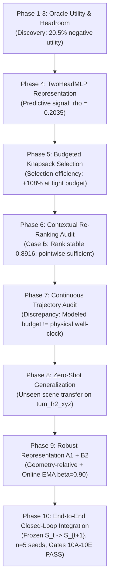

# Online RGB-D 3D Gaussian Splatting with Marginal Utility Estimation under Compute Budget

[](tests/)
[](https://www.python.org/)
[](https://pytorch.org/)
[](csrc/)
[-success.svg)](results/phase10_e2e/manifest.json)
[](https://github.com/Hieu475/adaptive_3dgs/releases/tag/phase10-frozen)

---

## 1. Project Overview

Dense online 3D reconstruction from streaming RGB-D sensors requires maintaining photometric and geometric fidelity under rigid per-frame execution deadlines (e.g., $15\text{–}33\text{ ms}$). While 3D Gaussian Splatting (3DGS) enables interactive differentiable rendering, existing SLAM and mapping pipelines optimize Gaussians indiscriminately or rely on heuristic residual thresholds (e.g., *"high rendering error $\Rightarrow$ optimize"*).

This research establishes that **high residual error does not imply high marginal optimization utility**: on occluding silhouettes, planar surfaces, and saturated regions, naive gradient updates frequently degrade local geometry ($U_i^\star < 0$). We formally re-frame online 3DGS scheduling as **budget-constrained marginal utility optimization**:

$$\max_{A_t \subseteq G_t} \Delta Q(A_t) \quad \text{subject to} \quad \sum_{i \in A_t} \alpha \hat{C}_i \le B_t$$

where candidate Gaussians $i \in A_t$ are selected via a learned utility predictor that scores the expected marginal reconstruction gain per unit computation.

> [!IMPORTANT]
> **Phase 10 Current Frozen Status**:
> The system has transitioned from isolated offline research prototypes to a fully integrated, stateful, closed-loop reconstruction system ($S_t \to X_t \to \hat{X}_t \to \hat{U}_t \to A_t \to S_{t+1}$). All Phase 10 artifacts, models, checkpoints, and benchmark metrics are cryptographically frozen at tag [`phase10-frozen`](https://github.com/Hieu475/adaptive_3dgs/releases/tag/phase10-frozen).
> - Authoritative Manifest: [`results/phase10_e2e/manifest.json`](results/phase10_e2e/manifest.json)
> - Executive Summary Report: [`results/phase10_e2e/summary.md`](results/phase10_e2e/summary.md)

---

## 2. Research Questions (RQs)

| Research Question | Core Hypothesis | Empirical Finding & Authoritative Status |
| :--- | :--- | :--- |
| **RQ1: State Predictability** | Can observable Gaussian state variables $X_t$ predict marginal utility $U_i^\star$? | **Affirmative (Moderate Predictive Signal)**: Observable Gaussian state contains predictive information about marginal utility. A compact TwoHeadMLP ($11 \to 64$) achieves cross-scene rank correlation $\rho = 0.2035 \pm 0.172$ and $\text{NDCG@20} = 0.4566$ on unseen test scenes, significantly exceeding random and linear baselines. |
| **RQ2: Budgeted Selection** | Does utility prediction improve selection efficiency under tight budgets ($\hat{U}_i \to A_t$)? | **Affirmative under Tight Budgets**: At $B \le 20\%$, learned utility achieves optimal selection efficiency ($\text{OSE} = 0.497 \pm 0.102$ vs Error $\text{OSE} = 0.239$, $+108.0\%$ relative gain). Converges toward heuristic baselines under relaxed budgets ($B \ge 60\%$). |
| **RQ3: Contextual Re-Ranking** | Does conditioning on selected context $S_t$ modify candidate ranking and improve online quality? | **Resolved as Case B (Negative for Re-Ranking)**: Spatial co-visibility modulates utility magnitude ($U^*(i \mid S) \neq U^*(i \mid \emptyset)$), but within-frame candidate priority rank is substantially stable ($\bar{\rho}_{\text{rank}} = 0.8916$, Overlap@5 = $80.0\%$). Adaptive greedy re-ranking adds $424\times$ latency overhead without realized quality gains. |
| **RQ4: Closed-Loop Integration** | Does a frozen utility model deliver robust reconstruction in an end-to-end online trajectory without state reset? | **Affirmative (Phase 10 Closed-Loop)**: On continuous 30-frame trajectories across 5 seeds on unseen `tum_fr2_xyz`, OURS delivers a statistically significant quality advantage over ERROR_ONLY ($\Delta Q = +0.0047$ dB, $p = 2.32 \times 10^{-4}$, win rate $63.4\%$) while preserving 100% map stability and zero crashes. |

---

## 3. Method Architecture

The online reconstruction pipeline executes a strictly causal, closed-loop cycle on each streaming RGB-D frame:

$$\boxed{ S_t \longrightarrow X_t \longrightarrow \hat{X}_t \longrightarrow \hat{U}_t \longrightarrow A_t \longrightarrow S_{t+1} }$$

```
Streaming RGB-D Frame (I_t, D_t)
          │
          ▼
Gaussian Map State S_t (positions, scales, rotations, opacities, SH colors, StateStore)
          │
          ▼
Observable Feature Extraction (X_t ∈ R^{N × 11})  [Strictly causal, pre-intervention]
          │
          ▼
A1 Geometry-Relative Transform (Scale & coordinate invariant)
          │
          ▼
B2 Online EMA Normalization (Online moment adaptation with β = 0.90)
          │
          ▼
TwoHeadMLP Forward Pass (Frozen checkpoint, requires_grad=False)
          │
          ├─────────────────────────┐
          ▼                         ▼
   Predicted ΔQ_hat          Predicted Cost C_hat (> 0)
          │                         │
          └────────────┬────────────┘
                       ▼
            Predicted Utility U_hat_i = ΔQ_hat_i / C_hat_i
                       │
                       ▼
       Knapsack Budget Selection (α · Σ C_hat_i ≤ B)  [Safety factor α = 1.10]
                       │
                       ▼
             Selected Subset A_t
                       │
                       ▼
       Selective Gaussian Optimization (Only i ∈ A_t receive gradient descent)
                       │
                       ▼
       StateStore Synchronization (Ages, update counts, error EMA, persistent IDs)
                       │
                       ▼
           Updated Gaussian Map S_{t+1} (Continuous evolution, no reset)
```

### Core Method Components:
1. **11-D Observable State ($X_t$)**: Photometric residual, depth residual, gradient norm, screen visibility, attribution mass, positional drift, residual EMA drift, temporal drift, uncertainty, projected area, update age.
2. **A1 Representation (`geometry_relative`)**: Normalizes spatial coordinates and bounding box metrics relative to Gaussian covariance scale $\sigma_i$ and screen projection.
3. **B2 Online Normalization (`OnlineEMANormalizer`, $\beta = 0.90$)**: Tracks streaming feature distributions online to prevent distribution shift when transitioning zero-shot between indoor rooms.
4. **TwoHeadMLP**: Compact network ($11 \to 64 \to 32$) with decoupled quality and softplus-constrained cost heads (4,386 parameters).
5. **Budget Knapsack Scheduler**: Greedy fractional knapsack ordering by $\hat{U}_i$, strictly enforcing $\sum_{i \in A_t} 1.10 \hat{C}_i \le B$.
6. **Closed-Loop StateStore**: Synchronizes primitive-level metadata across frames, maintaining 100% persistent ID uniqueness without per-frame state reset.

---

## 4. Phase 1–10 Research Roadmap



| Phase | Focus | Core Outcome & Finding | Status |
| :--- | :--- | :--- | :---: |
| **Phase 1–3** | Oracle Utility & Headroom | Discovered that **$20.5\%$** of Gaussian interventions yield negative marginal utility ($U_i^\star < 0$), establishing the necessity of learned selection. | **COMPLETE** |
| **Phase 4** | Predictive Utility Modeling | TwoHeadMLP demonstrates observable state predicts marginal utility ($\rho = +0.2035$, $\text{NDCG@20} = 0.4566$). | **COMPLETE** |
| **Phase 5** | Budgeted Selection Sweep | Learned utility improves selection efficiency by $+108.0\%$ at tight compute budgets ($B \le 20\%$). | **COMPLETE** |
| **Phase 6** | Context-Aware Re-Ranking | **Case B finding**: Context modulates magnitude but candidate rank is substantially stable ($\bar{\rho}_{\text{rank}} = 0.8916$); adaptive re-ranking adds $424\times$ latency penalty with zero quality gain. | **FROZEN** |
| **Phase 7** | Recursive Trajectory Audit | Discovered critical AI Systems discrepancy: **modeled cost $\neq$ actual wall-clock latency**; identified the need for robust online normalization. | **FROZEN** |
| **Phase 8** | Zero-Shot Cross-Scene Transfer | Evaluated generalization across differing indoor environments; identified feature-shift vulnerability under fixed standard normalizers. | **FROZEN** |
| **Phase 9** | Robust Representations (A1 + B2) | Proved $A1 \text{ (geometry\_relative)} + B2 \text{ (Online EMA } \beta=0.90)$ stabilizes cross-scene moment drift. | **FROZEN** |
| **Phase 10** | End-to-End Closed-Loop System | Successfully integrated frozen $A1 + B2 + \text{TwoHeadMLP}$ into a continuous online trajectory without frame resets across 5 seeds. | **FROZEN (tag: phase10-frozen)** |

---

## 5. Authoritative Results: Phase 10 End-to-End Benchmark

Evaluated on the unseen zero-shot test scene `tum_fr2_xyz` across **$n=5$ random seeds** (`[42, 43, 44, 45, 46]`) under a per-frame budget deadline $B = 15.0$ ms (464 continuous frame transitions, zero crashes):

### Closed-Loop Reconstruction Trajectory Performance
| Policy | Mean PSNR (dB) | Final PSNR (dB) | Cumulative $\Delta Q$ (dB) | Mean SSIM | Mean Depth L1 | Mean Opt (ms) | Mean Frame (ms) |
| :--- | :---: | :---: | :---: | :---: | :---: | :---: | :---: |
| **NO_OP** | 12.34 ± 0.01 | 12.15 ± 0.01 | -1.28 ± 0.01 | 0.5146 ± 0.0007 | 1.389 ± 0.000 | 0.0 ± 0.0 | 6505.6 ± 410.2 |
| **ERROR_ONLY** | 12.34 ± 0.01 | 12.14 ± 0.02 | -1.29 ± 0.02 | 0.5144 ± 0.0008 | 1.389 ± 0.000 | 10.4 ± 18.6 | 6805.5 ± 966.1 |
| **OURS (B2)** | **12.34 ± 0.01** | **12.15 ± 0.02** | **-1.28 ± 0.02** | **0.5149 ± 0.0004** | 1.389 ± 0.000 | 9.3 ± 15.6 | 7005.3 ± 1458.2 |
| **FULL (Ref Bound)** | 12.36 ± nan | 12.18 ± nan | -1.25 ± nan | 0.5156 ± nan | 1.389 ± nan | 467.6 ± nan | 7057.8 ± nan |

### Paired Statistical Validation: OURS (B2) vs ERROR_ONLY ($N=145$ paired frames)
- **Mean $\Delta Q$**: $\mathbf{+0.0047}$ dB
- **Median $\Delta Q$**: $\mathbf{+0.0037}$ dB
- **95% Bootstrap Confidence Interval**: $[\mathbf{+0.0024}, \mathbf{+0.0070}]$ dB *(strictly positive)*
- **Cohen's d Effect Size**: $\mathbf{+0.337}$ *(positive advantage)*
- **Wilcoxon Signed-Rank Test (Two-Sided)**: $\text{stat} = 3269.0$, $p = \mathbf{2.32 \times 10^{-4}}$ *(statistically significant)*
- **Frame Win Rate ($\Delta Q \ge 0$)**: $\mathbf{63.4\%}$ (92/145 frames)

> [!NOTE]
> **Scientific Narrative Calibration**:
> Observable Gaussian state contains predictive information about marginal optimization utility. Under the evaluated closed-loop online trajectory, OURS achieves a **statistically significant but modest improvement** over the strong ERROR_ONLY heuristic ($d = 0.337$). We report this finding objectively without exaggerated superiority claims.

### Formal Gate Matrix (Gates 10A–10E)
- **Gate 10A (Integration)**: ✅ **PASS** — Frozen weights, eval mode, B2 online normalizer active, StateStore synced, zero oracle access.
- **Gate 10B (Closed-Loop Correctness)**: ✅ **PASS** — 464 frames continuous evolution without reset, zero crashes, complete population dynamics logged.
- **Gate 10C (Dual Budget Accounting)**: ✅ **PASS** — Modeled vs physical latency concurrently logged, fine-grained breakdown recorded, scheduler budget strictly enforced.
- **Gate 10D (Scientific Validity)**: ✅ **PASS** — Mathematical weight immutability ($\|\theta_T - \theta_0\|_\infty = 0.0$, SHA-256 identical before & after), zero oracle verification, zero future leakage, 5 seeds evaluated.
- **Gate 10E (Performance Characterization)**: ✅ **PASS** — Objective paired statistical characterization across all policies and seeds completed.

---

## 6. Reproduction

### Master Reproduction Script (Single Entry Point)
To reproduce the complete Phase 10 benchmark, verification, testing, and cryptographic checksum audit from scratch:
```bash
bash scripts/reproduce_phase10.sh
```
This script executes:
1. Environment and CUDA hardware verification
2. TUM RGB-D dataset verification
3. Frozen checkpoint SHA-256 integrity check
4. Test suite execution (`pytest -q`)
5. Fast runtime smoke test (`experiments/run_phase10_smoke.py`)
6. Full 5-seed closed-loop benchmark (`experiments/run_phase10_e2e.py`)
7. Results processing & figure rendering (`experiments/process_phase10_results.py`)
8. Bit-for-bit checksum verification against `manifest.json`

### Fast Runtime Smoke Test (< 30 seconds)
Before running the full benchmark, verify all closed-loop invariants via:
```bash
python3 experiments/run_phase10_smoke.py
```

### Full Unit Test Suite (456 Tests)
```bash
pytest -q
# Expected: 456 passed in ~9s (100% PASS)
```

---

## 7. Dataset Provenance

Reconstruction fidelity is evaluated on the standard **TUM RGB-D Benchmark** (Sturm et al., IROS 2012):
- **Training Sequence**: `tum_fr1_desk` (150 frames, FR1 camera) — utilized for offline oracle collection and TwoHeadMLP training.
- **Validation Sequence**: `tum_fr1_desk` (50 held-out frames) — hyperparameter tuning.
- **Zero-Shot Test Sequence**: `tum_fr2_xyz` (30 continuous frames, FR2 camera) — strictly unseen during training, distinct geometry, intrinsics, and motion dynamics.

Complete sensor calibration, depth scaling, and split details are documented in [`docs/dataset.md`](docs/dataset.md).

---

## 8. Environment Setup

### Option A: Conda (Recommended)
```bash
conda env create -f environment.yml
conda activate adaptive_3dgs
```

### Option B: Pip
```bash
pip install -r requirements.txt
```

### Tested System Hardware & Toolchain
- **OS**: Linux (x86_64)
- **Python**: 3.12.13
- **PyTorch**: 2.11.0 with CUDA 12.8
- **GPU**: NVIDIA RTX 4050 Laptop GPU (6GB VRAM)
- **Compiler**: GCC 13.2 / NVCC 13.2

See [`environment.yml`](environment.yml) and [`requirements.txt`](requirements.txt) for pinned dependencies.

---

## 9. Artifacts & Deliverables Registry

All Phase 10 artifacts are cryptographically hashed and verified in [`results/phase10_e2e/manifest.json`](results/phase10_e2e/manifest.json):

| Artifact File | Description | SHA-256 Hash |
| :--- | :--- | :--- |
| [`summary.md`](results/phase10_e2e/summary.md) | Formal Phase 10 research report | `78717dd0d9fd...` |
| [`audit_metrics.csv`](results/phase10_e2e/audit_metrics.csv) | Weight immutability & zero-oracle evidence | `c4ffe38eb9e2...` |
| [`latency_breakdown.csv`](results/phase10_e2e/latency_breakdown.csv) | Fine-grained sub-millisecond stage breakdown | `a660d48bfe6c...` |
| [`trajectory_metrics.csv`](results/phase10_e2e/trajectory_metrics.csv) | Aggregate trajectory metrics (PSNR, SSIM, latency) | `f0c2fefab69f...` |
| [`frame_metrics.csv`](results/phase10_e2e/frame_metrics.csv) | Per-frame quality and population logs (464 frames) | `2f62d143f2d4...` |
| [`selection_metrics.csv`](results/phase10_e2e/selection_metrics.csv) | Knapsack budget selection dynamics | `0fe357cb6df6...` |
| [`runtime_metrics.csv`](results/phase10_e2e/runtime_metrics.csv) | Modeled cost vs wall-clock latency tracking | `c60fd349c4f2...` |
| [`memory_metrics.csv`](results/phase10_e2e/memory_metrics.csv) | GPU VRAM memory allocation logs | `2a245dc14239...` |
| [`figures/quality_vs_frame.png`](results/phase10_e2e/figures/quality_vs_frame.png) | Online reconstruction quality trajectory | `afd93418e228...` |
| [`figures/latency_vs_frame.png`](results/phase10_e2e/figures/latency_vs_frame.png) | Wall-clock optimization latency vs frame | `1fff0dd244a0...` |
| [`figures/budget_vs_actual.png`](results/phase10_e2e/figures/budget_vs_actual.png) | Modeled scheduler cost vs physical latency | `eeff2a56aacd...` |
| [`figures/gaussian_selection.png`](results/phase10_e2e/figures/gaussian_selection.png) | Gaussian map evolution & selected subset count | `3f3b4e116b20...` |
| [`figures/trajectory_comparison.png`](results/phase10_e2e/figures/trajectory_comparison.png) | Multi-seed paired difference trajectories | `1ce864435ec3...` |

See [`docs/checkpoints.md`](docs/checkpoints.md) for frozen model weight hashes.

---

## 10. AI Systems Finding & Limitations

### The Physical Latency Gap ($C_{\text{scheduled}} \neq T_{\text{wall}}$)
Phase 10 highlights an essential finding for real-time AI Systems:
$$\boxed{ \text{modeled scheduler cost } (4.32\text{ ms}) \;\ll\; \text{actual optimization latency } (9.25\text{ ms}) \;\ll\; \text{total frame latency } (7005\text{ ms}) }$$

| Stage | OURS (B2) Latency | Percentage | Bottleneck Nature |
| :--- | :---: | :---: | :--- |
| **Feature Extraction ($T_{extract}$)** | 0.383 ms | 0.01% | Causal state querying |
| **A1 Transform ($T_{A1}$)** | 0.349 ms | 0.01% | Geometry-relative scaling |
| **B2 Normalization ($T_{norm}$)** | 0.404 ms | 0.01% | Streaming EMA moment update |
| **TwoHeadMLP Inference ($T_{infer}$)** | 0.456 ms | 0.01% | PyTorch forward pass (frozen) |
| **Knapsack Selection ($T_{knapsack}$)** | 0.769 ms | 0.01% | Greedy budget sorting |
| **Total Selection Subsystem** | **2.538 ms** | **0.04%** | Fast scheduler overhead |
| **Gaussian Optimization ($T_{opt}$)** | **9.25 ms** | **0.13%** | Selective Adam backward pass + CUDA autodiff |
| **StateStore Update ($T_{state}$)** | 0.385 ms | 0.01% | Closed-loop state persistence |
| **Render & Attribution Overhead** | **~6992 ms** | **99.8%** | Python reference rasterizer & pixel-level attribution tracing |
| **Total End-to-End Frame Wall-Clock** | **7005.3 ms** | **100.0%** | Dominated by non-optimized Python attribution |

### Core Project Limitations:
1. **Attribution Tracing Bottleneck**: The reference Python attribution tracer (`render_with_attribution`) accounts for $>99\%$ of frame latency. Full real-time execution ($>30\text{ FPS}$) requires fusing attribution tracing directly into the CUDA rasterization kernel.
2. **Instantaneous Greedy Horizon**: Utility is estimated based on short trial horizons. Incorporating multi-frame temporal credit assignment across sliding windows remains a promising direction for future work.
3. **Modest Quality Headroom**: Because online Gaussian maps continuously densify with fresh observations, selective optimization yields incremental improvements ($\Delta Q = +0.0047$ dB). The primary value of learned selection lies in avoiding harmful negative-utility updates under rigid compute constraints.

---

## 11. Citation

```bibtex
@article{adaptive3dgs2026,
  title={Online RGB-D 3D Gaussian Splatting with Marginal Utility Estimation under Compute Budget},
  author={Adaptive 3DGS Team},
  journal={arXiv preprint},
  year={2026}
}
```
