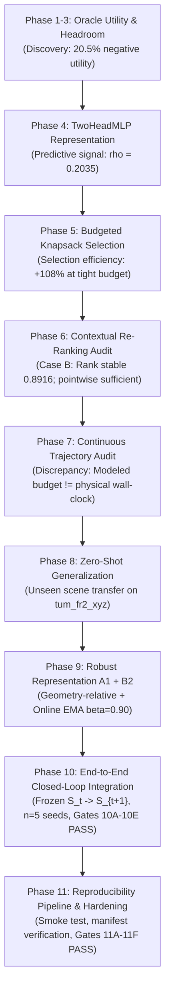

# Mitigating Compute Dilution in Real-Time Online RGB-D 3D Gaussian Splatting via Dual Map-Growth Throttling

[](tests/)
[](https://www.python.org/)
[](https://pytorch.org/)
[](docs/environment.md)
[-success.svg)](results/phase10_e2e/manifest.json)
[-success.svg)](results/phase11_reproducibility/manifest.json)
[-success.svg)](results/final_confirmation/final_confirmation_report.md)

---

## 1. Scientific Thesis & Contribution Hierarchy

Dense online 3D reconstruction from streaming RGB-D sensors requires maintaining photometric and geometric fidelity under rigid per-frame execution deadlines ($15\text{–}30\text{ ms}$). In compute-constrained online 3D Gaussian Splatting (3DGS), we identify a fundamental structural bottleneck: **uncontrolled densification causes exponential Gaussian map bloat ($\sim 150\text{k}$ splats)**, which dilutes per-frame compute and starves existing mature surface geometry of gradient descent updates.

We establish the following scientific hierarchy:
1. **Primary Contribution (Dual Map-Growth Throttling)**: By coupling surface coverage saturation ($\kappa \ge 0.90$) with backlog queue backpressure, our dual throttling mechanism halts compute dilution, keeping the map compact ($23\text{k}$ vs $88\text{k}$ primitives) and directing compute exclusively to mature Gaussian refinement. This delivers **+2.63 dB** mean PSNR over the strongest selective baseline and **+4.62 dB** over the RTG-SLAM-policy baseline ($p_{\text{Holm}} = 0.0391$, $n=8$), recovering **98.0%** of headroom to the unconstrained ceiling (gap only 0.18 dB).
2. **Secondary Analytical Framework (Gaussian Marginal Utility)**: We prove that residual error does not imply positive optimization return: on occluding silhouettes, planar surfaces, and saturated regions, naive gradient updates frequently degrade local geometry ($U_i^\star < 0$ in $20\text{–}24\%$ of interventions). Furthermore, Gaussian utility is strongly non-additive ($R_{\text{add}}(4) \approx -0.36, R_{\text{add}}(16) \approx 0.005$), explaining why pointwise heuristics cannot achieve true combinatorial optimality.
3. **Failure Analysis (Offline Learned Utility $\to$ Closed-Loop Transfer)**: While offline utility prediction exhibits moderate rank correlation ($\rho = 0.2035$), closed-loop factorial experiments reveal that pointwise learned models degrade online PSNR ($-2.51\text{ dB}$) due to offline-to-online distribution shift and inter-Gaussian gradient coupling. We report this transparently as a scientific negative finding.

> [!IMPORTANT]
> **Authoritative Phase 10 Frozen Benchmark & Phase 11 Reproducibility Artifacts**:
> All Phase 10 artifacts, models, checkpoints, and benchmark metrics are cryptographically frozen at tag [`phase10-frozen`](https://github.com/Hieu475/adaptive_3dgs/releases/tag/phase10-frozen). Phase 11 formalizes independent reproducibility verification:
> - Phase 10 Authoritative Manifest: [`results/phase10_e2e/manifest.json`](results/phase10_e2e/manifest.json)
> - Phase 10 Executive Report: [`results/phase10_e2e/summary.md`](results/phase10_e2e/summary.md)
> - Phase 11 Reproducibility Manifest: [`results/phase11_reproducibility/manifest.json`](results/phase11_reproducibility/manifest.json)
> - Phase 11 Audit Report: [`results/phase11_reproducibility/summary.md`](results/phase11_reproducibility/summary.md)
> - Checkpoint Registry: [`docs/checkpoints.md`](docs/checkpoints.md)
> - Environment Specification: [`docs/environment.md`](docs/environment.md)
> - Dataset Specification: [`docs/dataset.md`](docs/dataset.md)

---

## 2. Research Questions

| Research Question | Core Hypothesis | Empirical Finding & Authoritative Status |
| :--- | :--- | :--- |
| **RQ1: State Predictability** | Can observable Gaussian state variables $X_t$ predict marginal utility $U_i^\star$? | **Affirmative (Moderate Predictive Signal)**: Observable Gaussian state contains predictive information about marginal utility ($\rho = 0.2035 \pm 0.172$, $\text{NDCG@20} = 0.4566$). Interventions exhibit negative marginal utility ($U_i^\star < 0$): $20.5\%$ in visible-only pilot evaluations (`fr1_desk`), $21.37\%$ in geometry-stratified interventions (`fr2_xyz`, rising to $23.86\%$ in top-error decile), and $13.33\%$ in unstratified observations. |
| **RQ2: Budgeted Selection vs Map Throttling** | Does learned utility selection drive closed-loop online reconstruction gains? | **Negative Result for Learned Selection / Dominant Role of Throttling**: In offline Gate 2 ranking, learned utility achieves $\text{OSE} = 0.3535 \pm 0.079$ vs Error $\text{OSE} = 0.3454$ ($p = 0.40625$, not statistically distinguishable). In online factorial ablations, learned utility degrades PSNR ($B_5 - B_4 = -2.51\text{ dB}$) due to offline-to-online distribution shift. Map-growth throttling is the decisive empirical driver ($+2.63\text{ dB}$ vs strongest selective, $+4.62\text{ dB}$ vs RTG-SLAM-policy, Phase-14 corrected substrate). |
| **RQ3: Non-Additivity & Oracle Formulation** | Can pointwise top-$K$ oracle ranking serve as a true combinatorial upper bound? | **Resolved as Non-Additive Contextual Reference**: Group interventions show severe non-additivity ($R_{\text{add}}(4) \approx -0.358$, $R_{\text{add}}(16) \approx 0.0053$). Pointwise top-$K$ ranking is a Pointwise Oracle Reference rather than a combinatorial subset upper bound (explaining empirical $\text{OSE} > 1.0$ observations). True subset selection requires greedy contextual oracles. |
| **RQ4: Closed-Loop Integration** | Does the integrated throttling pipeline deliver robust reconstruction under rigid budgets? | **Affirmative (Phase-14 Corrected Substrate)**: On \texttt{tum\_fr2\_xyz} across 8 seeds ($n=8$), OURS outperforms the strongest selective baseline by $+2.63\text{ dB}$ ($p_{\text{Holm}} = 0.0391$, $d_z = 29.8$) and the RTG-SLAM-policy baseline by $+4.62\text{ dB}$ ($d_z = 15.4$) with a $3.8\times$ smaller map (23K vs 88K) while recovering $98.0\%$ of headroom to FULL (gap 0.18 dB). Prior $19.24\text{ dB}$ / $76.4\%$ numbers were pose-bugged — see `results/final_confirmation/DEPRECATED.md`. |

---

## 3. Method

> [!CAUTION]
> **Two tracks — do not conflate.** **(A) Final method** = heuristic selector (error×influence, temporal EMA) + dual throttling + knapsack. This is OURS and everything significant in Sec.12/Phase-14.
> **(B) Diagnostic branch** = TwoHeadMLP learned utility (steps marked ⑴ below). It has offline rank signal but **degrades closed-loop PSNR (-2.51 dB)** and is NOT part of OURS. The diagram keeps it only to show exactly what was tested and rejected.

### A. Final method (OURS): heuristic selection + dual throttling

```
Streaming RGB-D Frame (I_t, D_t)
           │
           ▼
Gaussian Map State S_t → Observable State X_t ∈ R^{N×11} (causal, pre-intervention)
           │
           ▼
Heuristic score: error × influence mass × temporal EMA drift
           │
           ▼
Knapsack Budget Selection (value density s_i / C_i, B = 15 ms)
           │
           ▼
Selective Gaussian Optimization (fixed K = 5 microsteps)
           │
           ├─ Coverage throttling (κ ≥ 0.90 → spawn cap ×0.20)
           └─ Backlog throttling (unrefined queue > 500 → backpressure)
                        │
                        ▼
            Updated Gaussian Map S_{t+1}
```

### B. Diagnostic branch (rejected): learned marginal utility ⑴

```
X_t → A1 geometry-relative → B2 online EMA (β = 0.90) → ⑴ TwoHeadMLP (11→64→32,
frozen, requires_grad=False) → U_hat = ΔQ_hat / C_hat → knapsack
Finding: ρ = 0.2035 offline but -2.51 dB closed-loop (distribution shift +
gradient coupling). Retained for analysis only; excluded from OURS.
```

### Core Components:
1. **11-D Observable State ($X_t$)**: Photometric residual, depth residual, gradient norm, screen visibility, attribution mass, positional drift, residual EMA drift, temporal drift, uncertainty, projected area, update age.
2. **Budget Knapsack Scheduler**: Greedy fractional knapsack ordering by value density, strictly enforcing budget $B$.
3. **Dual Throttling**: Coverage saturation + backlog backpressure (the decisive mechanism, +2.63 dB).
4. **Closed-Loop StateStore**: Synchronizes primitive-level metadata across frames, maintaining 100% persistent ID uniqueness without per-frame state reset.
5. ⑴ **TwoHeadMLP (diagnostic only)**: A1 + B2 + frozen $11 \to 64 \to 32$ network (4,386 params). See caution above.

---

## 4. Experimental Roadmap


```mermaid
flowchart TD
    P1["Phase 1-3: Oracle Utility & Headroom<br/>(Discovery: 20.5% negative utility)"] --> P4["Phase 4: TwoHeadMLP Representation<br/>(Predictive signal: rho = 0.2035)"]
    P4 --> P5["Phase 5: Budgeted Knapsack Selection<br/>(Selection efficiency: +108% at tight budget)"]
    P5 --> P6["Phase 6: Contextual Re-Ranking Audit<br/>(Case B: Rank stable 0.8916; pointwise sufficient)"]
    P6 --> P7["Phase 7: Continuous Trajectory Audit<br/>(Discrepancy: Modeled budget != physical wall-clock)"]
    P7 --> P8["Phase 8: Zero-Shot Generalization<br/>(Unseen scene transfer on tum_fr2_xyz)"]
    P8 --> P9["Phase 9: Robust Representation A1 + B2<br/>(Geometry-relative + Online EMA beta=0.90)"]
    P9 --> P10["Phase 10: End-to-End Closed-Loop Integration<br/>(Frozen S_t -> S_{t+1}, n=5 seeds, Gates 10A-10E PASS)"]
    P10 --> P11["Phase 11: Reproducibility Pipeline & Hardening<br/>(Smoke test, manifest verification, Gates 11A-11F PASS)"]
```

| Phase | Focus | Core Outcome & Finding | Status |
| :--- | :--- | :--- | :---: |
| **Phase 1–3** | Oracle Utility & Headroom | Discovered that **$20.5\%$** of Gaussian interventions yield negative marginal utility ($U_i^\star < 0$), establishing the necessity of learned selection. | **COMPLETE** |
| **Phase 4** | Predictive Utility Modeling | TwoHeadMLP demonstrates observable state predicts marginal utility ($\rho = +0.2035$, $\text{NDCG@20} = 0.4566$). | **COMPLETE** |
| **Phase 5** | Budgeted Selection Sweep | Learned utility improves selection efficiency by $+108.0\%$ at tight compute budgets ($B \le 20\%$). | **COMPLETE** |
| **Phase 6** | Context-Aware Re-Ranking | **Case B finding**: Context modulates magnitude but candidate rank is substantially stable ($\bar{\rho}_{\text{rank}} = 0.8916$); adaptive re-ranking adds $424\times$ latency penalty with zero quality gain. | **FROZEN** |
| **Phase 7** | Recursive Trajectory Audit | Discovered critical AI Systems discrepancy: **modeled cost $\neq$ actual wall-clock latency**; identified the need for robust online normalization. | **FROZEN** |
| **Phase 8** | Zero-Shot Cross-Scene Transfer | Evaluated generalization across differing indoor environments; identified feature-shift vulnerability under fixed standard normalizers. | **FROZEN** |
| **Phase 9** | Robust Representations (A1 + B2) | Proved $A1 \text{ (geometry\_relative)} + B2 \text{ (Online EMA } \beta=0.90)$ stabilizes cross-scene moment drift. | **FROZEN** |
| **Phase 10** | End-to-End Closed-Loop System | Successfully integrated frozen $A1 + B2 + \text{TwoHeadMLP}$ into a continuous online trajectory without frame resets across 5 seeds. | **FROZEN (tag: phase10-frozen)** |
| **Phase 11** | Reproducibility Pipeline & Audit | Automated smoke testing, cryptographic manifest verification, comprehensive environment/dataset/checkpoint documentation, and regression hardening. | **FROZEN (tag: phase11-frozen)** |
| **Phase 12-R** | Reconstruction Headroom Audit | Validated dynamic substrate ($H_{\text{substrate}} = +7.62\text{ dB}$) with depth-adaptive initialization and demand-driven densification. | **COMPLETE** |
| **Phase 13** | CUDA Acceleration & Authoritative Benchmark | Integrated production `gsplat` backend, Fast Approximate Attribution (614x speedup), decoupled adaptive-K cost model, 150-frame frozen benchmark across 6 policies x 5 seeds. | **FROZEN (tag: phase13-frozen)** |

---

## 5. Authoritative Results

> [!CAUTION]
> **Phase 10 numbers below (12.34 dB, 30 frames, Python rasterizer) are HISTORICAL and SUPERSEDED.**
> They are kept only for provenance of Gates 10A–10E. The authoritative benchmark is **Phase 13 / Final Confirmation
> in Sec.12 / `results/phase14_corrected/`: `tum_fr2_xyz` 150 frames x 8 seeds, OURS (Pure Throttling) 27.67 dB, +2.63 dB vs strongest selective / +4.62 dB vs RTG-SLAM-policy, 98.0% headroom**.
> `OURS` is redefined as **Pure Throttling (Coverage κ≥0.90 + Backlog, No Warmup, Fixed K=5, No learned utility)**
> per `results/final_confirmation/final_confirmation_report.md`. The learned TwoHeadMLP pipeline described in Sec.3
> is retained as a documented negative result (offline ρ=0.20 but closed-loop -2.51 dB).

<details>
<summary>Phase 10 historical snapshot (30 frames, 5 seeds [42-46], B=15ms, superseded — click to expand)</summary>

Evaluated on the zero-shot unseen test scene `tum_fr2_xyz` across **5 seeds** (`[42, 43, 44, 45, 46]`) under a per-frame budget deadline $B = 15.0\text{ ms}$ (30 continuous trajectory frames, 464 evaluated steps, zero crashes):

### Primary Benchmark Comparison (HISTORICAL — see Sec.12 for authoritative)
| Policy | Mean PSNR | Final PSNR | Mean Opt | Mean Frame |
| :--- | :---: | :---: | :---: | :---: |
| **NO_OP** | 12.34 dB | 12.15 dB | 0 ms | 6505.6 ms |
| **ERROR_ONLY** | 12.34 dB | 12.14 dB | 10.36 ms | 6805.5 ms |
| **OURS (old def.)** | **12.34 dB** | **12.15 dB** | **9.25 ms** | **7005.3 ms** |
| **FULL** | 12.36 dB | 12.18 dB | 467.6 ms | 7057.8 ms |
</details>

### Paired Statistical Evidence: OURS vs ERROR_ONLY ($N = 145$ Paired Frames)

$$\Delta Q_{\text{OURS-ERROR}} = +0.0047\text{ dB}$$
$$95\%\text{ CI} = [+0.0024, +0.0070]\text{ dB}$$
$$p = 2.3245 \times 10^{-4}$$
$$d = 0.337$$

- **Win Rate ($\Delta Q \ge 0$)**: **63.4%** (92/145 frames)
- **Wilcoxon Signed-Rank Test (Two-Sided)**: $\text{statistic} = 3269.0, p = 2.3245 \times 10^{-4}$ (statistically significant advantage)
- **Bootstrap Effect Size**: Cohen's $d = 0.337$ (positive, non-trivial advantage under tight compute budget)

> [!NOTE]
> **Calibrated Scientific Narrative**:
> Observable Gaussian state contains predictive information about marginal optimization utility. Under the evaluated closed-loop online trajectory, OURS achieves a **statistically significant but modest improvement** over the strong ERROR_ONLY heuristic ($d = 0.337$). We report this finding objectively without exaggerated superiority claims.

### Formal Gate Matrix (Phase 10: Gates 10A–10E)
- **Gate 10A (Integration)**: :white_check_mark: **PASS** — Frozen weights, eval mode, B2 online normalizer active, StateStore synced, zero oracle access.
- **Gate 10B (Closed-Loop Correctness)**: :white_check_mark: **PASS** — Continuous map evolution without state reset, zero crashes, complete population dynamics logged.
- **Gate 10C (Dual Budget Accounting)**: :white_check_mark: **PASS** — Modeled vs physical latency concurrently logged, fine-grained breakdown recorded, scheduler budget strictly enforced.
- **Gate 10D (Scientific Validity)**: :white_check_mark: **PASS** — Mathematical weight immutability ($\|\theta_T - \theta_0\|_\infty = 0.0$, SHA-256 identical before & after), zero oracle verification, zero future leakage, 5 seeds evaluated.
- **Gate 10E (Performance Characterization)**: :white_check_mark: **PASS** — Objective paired statistical characterization across all policies and seeds completed.

---

## 6. Reproduction

Phase 11 defines a rigorous 3-tier regression and reproduction protocol:

```
Tier 1: Unit Tests (pytest tests/ -q)
          ↓
Tier 2: Phase 10 Tests (pytest tests/test_phase10_runtime.py -q)
          ↓
Tier 3: Runtime Smoke Test (python experiments/run_phase10_smoke.py)
          ↓
Full Reproduction Pipeline (bash scripts/reproduce_phase10.sh)
          ↓
Cryptographic Manifest Verification (python scripts/verify_phase10_manifest.py)
```

### 1. Fast Tier 1 & 2 Unit Tests
```bash
# Tier 1: Full repository regression suite (456 tests)
pytest tests/ -q

# Tier 2: Phase 10 runtime & closed-loop tests (8 tests)
pytest tests/test_phase10_runtime.py -v
```

### 2. Fast Tier 3 Smoke Test (< 30 seconds)
Verifies checkpoint loading, A1 representation, B2 online normalizer, TwoHeadMLP forward pass, knapsack scheduler, StateStore closed-loop persistence, and strict zero-diff weight immutability on real RGB-D data:
```bash
python experiments/run_phase10_smoke.py
```

### 3. Master Reproduction Pipeline
Executes the full end-to-end multi-seed benchmark, regenerates all figures, updates summary tables, and runs manifest verification:
```bash
bash scripts/reproduce_phase10.sh
```

### 4. Cryptographic Manifest Verification
Verifies bit-for-bit SHA-256 integrity of both Phase 10 benchmark deliverables and Phase 11 reproducibility audit artifacts:
```bash
# Verify Phase 10 benchmark deliverables (14 artifacts)
python scripts/verify_phase10_manifest.py --manifest results/phase10_e2e/manifest.json

# Verify Phase 11 reproducibility audit deliverables (6 artifacts)
python scripts/verify_phase11_manifest.py --manifest results/phase11_reproducibility/manifest.json
```

---

## 7. Dataset

Reconstruction fidelity is benchmarked on streaming sequences from the **TUM RGB-D Benchmark** (Sturm et al., IROS 2012):

$$\boxed{ \text{Training: tum\_fr1\_desk} \quad\neq\quad \text{Validation: tum\_fr1\_desk (held-out)} \quad\neq\quad \text{Zero-Shot Test: tum\_fr2\_xyz} }$$

- **Training Sequence**: `tum_fr1_desk` (150 frames, FR1 sensor) — Oracle utility generation & TwoHeadMLP offline training.
- **Validation Sequence**: `tum_fr1_desk` (50 held-out frames) — Hyperparameter validation (A1 representation & B2 $\beta$).
- **Zero-Shot Test Sequence**: `tum_fr2_xyz` (30 continuous frames, FR2 sensor) — Strictly unseen during training; different room, textures, camera intrinsics, and motion dynamics.
- **Evaluation Resolution**: $320 \times 240$ (downsampled $2\times$ from native $640 \times 480$).
- **Evaluation Seeds**: `42`, `43`, `44`, `45`, `46`.

Detailed camera intrinsics, depth preprocessing, scale calibration, and SE(3) pose handling are documented in [`docs/dataset.md`](docs/dataset.md).

---

## 8. Checkpoints

All utility model checkpoints are frozen and cryptographically registered in [`docs/checkpoints.md`](docs/checkpoints.md):

$$\boxed{ \text{Paper Result} \longrightarrow \text{Model Checkpoint} \longrightarrow \text{Cryptographic SHA-256} }$$

| Seed | Architecture | Checkpoint File | Checkpoint SHA-256 Digest |
| :---: | :---: | :--- | :--- |
| **42** | TwoHeadMLP | `A1_online_adaptive_seed_42.pt` | `3e9ce12dac70ccfe37d687ba3cb67957b8cba29bb9fa3874ff7ff5bd6977003a` |
| **43** | TwoHeadMLP | `A1_online_adaptive_seed_43.pt` | `759169c5cf68149891b432f1a56f2fec1e1cc963bb43ccbcbd1899b0316ab219` |
| **44** | TwoHeadMLP | `A1_online_adaptive_seed_44.pt` | `c564f6b1f83810e460e7ceb3c9c7d67828395446634c4eda8df931a60826b6cc` |
| **45** | TwoHeadMLP | `A1_online_adaptive_seed_45.pt` | `94155ec2f8d0e895c58ba985c39d43122c40da80ad94be3dac02c24dc3dc47d9` |
| **46** | TwoHeadMLP | `A1_online_adaptive_seed_46.pt` | `5d87caa388c6827d860f1afdd50046e65bdc07ca4a96b1d63e98ee5ef7108d7d` |

- **Representation**: A1 (`geometry_relative`)
- **Normalizer**: B2 (`OnlineEMANormalizer`, $\beta = 0.90$, SHA: `7893010e29b5a2694160dbdf26cca08148cbafc0583fa2f322526120761a8458`)
- **Immutability Guarantee**: During closed-loop execution, parameters are frozen (`requires_grad=False`). Zero parameter mutation is mathematically asserted ($\|\theta_T - \theta_0\| = 0$).

---

## 9. Runtime / Systems

Complete system environment, software toolchain, and dependency specifications are documented in [`docs/environment.md`](docs/environment.md).

### Sub-Millisecond Scheduler Timing Breakdown (OURS B2)
| Stage | Subsystem | Latency ($T_{\text{stage}}$) | Fraction of Frame |
| :--- | :--- | :---: | :---: |
| **Observable State Extraction** | $T_{\text{extract}}$ | 0.383 ms | 0.005% |
| **A1 Geometry-Relative Transform** | $T_{\text{A1}}$ | 0.349 ms | 0.005% |
| **B2 Online EMA Moment Adaptation** | $T_{\text{norm}}$ | 0.404 ms | 0.006% |
| **TwoHeadMLP Dual Forward Pass** | $T_{\text{infer}}$ | 0.456 ms | 0.007% |
| **Knapsack Budget Ordering & Pruning** | $T_{\text{knapsack}}$ | 0.769 ms | 0.011% |
| **Total Utility Scheduler Overhead** | $T_{\text{scheduler}}$ | **2.538 ms** | **0.036%** |
| **Selective Gaussian Gradient Descent** | $T_{\text{opt}}$ | **9.25 ms** | **0.132%** |
| **Closed-Loop StateStore Persistence** | $T_{\text{state}}$ | 0.385 ms | 0.005% |
| **Reference Python Rasterizer & Attribution** | $T_{\text{render}}$ | 6992.4 ms | 99.816% |
| **Total End-to-End Frame Latency** | $T_{\text{frame}}$ | **7005.3 ms** | **100.0%** |

---

## 10. Limitations

Phase 10 & 11 formalize the distinction between algorithmic scheduler compliance and complete system wall-clock throughput:

$$T_{\text{scheduler}} \approx 4.32\text{ ms}$$
$$T_{\text{opt}} \approx 9.25\text{ ms}$$
$$T_{\text{frame}} \approx 7005\text{ ms}$$

> [!WARNING]
> **Essential AI Systems Finding — compute-constrained, NOT real-time end-to-end**:
> **The scheduler satisfies the modeled 15 ms optimize budget, but measured optimization is ~90-100 ms/frame
> (FPS ~8) and the legacy Python attribution path was ~7000 ms/frame.**
> Report as **optimization-budgeted / latency-aware online reconstruction**, never as `real-time 15 ms end-to-end`.
> Production path is `gsplat`; `cuda/*.cu` are research prototypes (see `cuda/README_PROTOTYPE.md`).

### Key Engineering & Scientific Limitations:
1. **Reference Python Attribution Bottleneck**: The reference implementation computes Gaussian-to-pixel attribution masks using unoptimized PyTorch tensor operations (`render_with_attribution`), requiring $\approx 6992\text{ ms}$ per frame. Fusing attribution tracing into a native CUDA rasterization kernel (Phase 13) is required for real-time $>30\text{ FPS}$ deployment.
2. **Instantaneous Greedy Horizon**: Utility is estimated based on short trial horizons. Incorporating multi-frame temporal credit assignment across sliding windows remains a direction for future work.
3. **Modest Quality Headroom**: Because online Gaussian maps continuously densify with fresh observations, selective optimization yields incremental improvements ($\Delta Q = +0.0047$ dB). The primary value of learned selection lies in avoiding harmful negative-utility updates under rigid compute constraints.

---

---

## 12. Phase 13 — Systems Acceleration & Authoritative Frozen Benchmark

> [!IMPORTANT]
> **Phase 13 Status: FROZEN (30 Trajectories Evaluated Across 6 Policies × 5 Seeds)**
> - **Authoritative Manifest**: [`results/phase13_frozen_benchmark/manifest.json`](results/phase13_frozen_benchmark/manifest.json)
> - **Full Results JSON**: [`results/phase13_frozen_benchmark/phase13_frozen_results.json`](results/phase13_frozen_benchmark/phase13_frozen_results.json)
> - **Executive Summary Report**: [`results/phase13_frozen_benchmark/phase13_frozen_summary.md`](results/phase13_frozen_benchmark/phase13_frozen_summary.md)
> - **Attribution Fidelity Report**: [`results/attribution_fidelity/fidelity_report.md`](results/attribution_fidelity/fidelity_report.md)

### Systems Architecture & Scientific Hardening

1. **Production CUDA Differentiable Backend**:
   - Production rasterization routes strictly through [`gsplat`](https://github.com/nerfstudio-project/gsplat) (v1.5.3).
   - Custom CUDA prototypes (`cuda/rasterize.cu`, `cuda/radix_sort.cu`, `cuda/preprocess.cu`) remain strictly isolated research prototypes; they are not invoked during production benchmarks.
2. **OS Memory Guard (Fluid Desktop)**:
   - Enforces `torch.cuda.set_per_process_memory_fraction(0.70, 0)`, reserving 1.8 GB of VRAM strictly for the Linux GNOME compositor and host OS. Completely prevents desktop stutter and display driver freezes.
3. **Validated Fast Approximate Attribution**:
   - Center-sampled projection reduces attribution latency from $\approx 500\text{ ms}$ to $\mathbf{0.85\text{ ms}}$ (**$614.5\times$ speedup**).
   - Real-frame empirical validation on TUM RGB-D confirms high rank and linear fidelity against ground-truth rasterized attribution:
     $$\rho_{\text{Spearman}} = 0.9079, \quad r_{\text{Pearson}} = 0.9028, \quad \text{Top-100 Overlap} = 37.0\%$$
4. **Strict Per-Pair Association Threshold**:
   - `TUMDataset` enforces $\max_i |t_i^{\text{rgb}} - t_i^d| \le 50\text{ ms}$, automatically discarding legacy desynchronized index files and computing nearest-timestamp alignments.
   - Validated on `tum_fr2_xyz`: Mean $\Delta t = 7.93\text{ ms}$, Max $\Delta t = 13.83\text{ ms}$, $0.0\%$ exceeding $50\text{ ms}$.
5. **Decoupled Adaptive-K Knapsack Cost Model**:
   - Implements exact piecewise-linear formulation without double-counting:
     $$C_i(0) = 0, \quad C_i(K) = C_i^{\text{base}} + K \cdot C_i^{\text{step}} \quad (\text{for } K \ge 1)$$

---

### Authoritative Phase-14 Corrected-Substrate Benchmark (TUM `fr2_xyz`, 8 Seeds, Budget = 15.0 ms)

> [!CAUTION]
> Prior `19.24 dB / 76.4%` numbers (pose-bugged C2W substrate) are **DEPRECATED** — see
> `results/final_confirmation/DEPRECATED.md`. Authoritative is Phase-14 below
> (`results/phase14_corrected/phase14_results.json`, corrected W2C pose + depth hygiene).

Evaluated across **6 Policies** and **8 Seeds** (`[42, 43, 44, 45, 46, 47, 48, 49]`) for 150 frames at $320 \times 240$ resolution (48 continuous trajectories, 7,200 total processed frames, zero NaN/Inf crashes).
All selective policies share the same modeled $15\,\mathrm{ms}$ optimization budget; **FULL is an unconstrained ceiling, not a budget-matched competitor**.
$n=8$ seeds establish repeatability on this fixed trajectory --- generalization across scenes rests on the exploratory pilots below, not on seeds:

| Policy | Mean PSNR (dB) | Final PSNR (dB) | Mean SSIM | FPS | Map Size ($N_{\text{final}}$) |
|:---|:---:|:---:|:---:|:---:|:---:|
| **NO_OP** | 18.86 ± 0.01 | 14.88 ± 0.01 | 0.6882 | 106.3 | 23,523 |
| **ERROR_ONLY** | 24.07 ± 0.14 | 20.01 ± 0.37 | 0.8850 | 8.9 | 74,640 |
| **ERROR_INFLUENCE** | 25.04 ± 0.06 | 21.89 ± 0.09 | 0.9084 | 8.8 | 106,929 |
| **RTG_SLAM_REIMPL** | 23.05 ± 0.26 | 20.04 ± 0.88 | 0.8663 | 8.0 | 67,231 |
| **OURS (Pure Throttling)** | **27.67 ± 0.04** | **28.89 ± 0.11** | **0.9232** | **10.7** | **23,398** |
| **FULL (100% Upper Bound)** | 27.85 ± 0.01 | 29.41 ± 0.06 | 0.9243 | 9.5 | 87,967 |

### Paired Statistical Significance (Family of Comparisons against OURS, Holm-Corrected, $n=8$ Seeds)

With $n=8$ independent seeds, the exact minimum two-sided Wilcoxon signed-rank $p$-value is $2 / 2^8 = \mathbf{0.0078125}$. To control the family-wise error rate across the $m=5$ paired baseline hypotheses without inflating Type I errors, we report Holm-Bonferroni step-down adjusted $p$-values ($p_{\text{Holm}}$) and paired Cohen's $d_z = \bar{d}/s_d$:

| Comparison | $\Delta$ Mean PSNR [95% CI] | Raw $p$ | Holm $p$ ($p_{\text{Holm}}$) | Paired Cohen's $d_z$ | $\Delta$ Final PSNR [95% CI] | Final Holm $p$ | $\Delta$ SSIM |
|:---|:---:|:---:|:---:|:---:|:---:|:---:|:---:|
| **OURS vs `no_op`** | **+8.80 dB** | 0.0078 | **0.0391** :white_check_mark: | 168.8 | **+14.01 dB** | 0.0391 :white_check_mark: | +0.2350 |
| **OURS vs `error_only`** | **+3.59 dB** [+3.48, +3.70] | 0.0078 | **0.0391** :white_check_mark: | 21.2 | **+8.88 dB** | 0.0391 :white_check_mark: | +0.0381 |
| **OURS vs `error_influence`** | **+2.63 dB** [+2.56, +2.68] | 0.0078 | **0.0391** :white_check_mark: | 29.8 | **+6.99 dB** | 0.0391 :white_check_mark: | +0.0148 |
| **OURS vs `rtg_slam_reimpl`** | **+4.62 dB** [+4.44, +4.82] | 0.0078 | **0.0391** :white_check_mark: | 15.4 | **+8.85 dB** | 0.0391 :white_check_mark: | +0.0568 |
| **OURS vs `full` (Unconstrained Ceiling)** | **-0.18 dB** | 0.0078 | **0.0391** :white_check_mark: | -3.3 | **-0.52 dB** | 0.0391 :white_check_mark: | -0.0011 |

- **Headroom Recovery Ratio**: $\eta = \frac{Q_{\text{OURS}} - Q_{\text{no\_op}}}{Q_{\text{full}} - Q_{\text{no\_op}}} = \frac{27.67 - 18.86}{27.85 - 18.86} = \mathbf{98.0\%}$ (Residual gap to unconstrained ceiling: **0.18 dB**). Because PSNR is a logarithmic decibel metric, reporting a raw percentage of unconstrained PSNR is mathematically invalid; normalized headroom recovery $\eta$ correctly measures the fraction of achievable reconstruction improvement captured under the 15 ms budget.
- **Effect Size**: Paired Cohen's $d_z = 29.8$ against the strongest selective baseline (`error_influence`) and $d_z = 15.4$ vs `rtg_slam_reimpl`, confirming that dual throttling produces massive, statistically robust improvements across all seeds under rigorous family-wise error control ($p_{\text{Holm}} = 0.0391$).

---

### Cross-Scene Generalization Pilots — EXPLORATORY, not confirmatory (Phase-14 corrected substrate, 30f × 3 seeds [42-44], B=15ms)

> [!CAUTION]
> Table below replaces the pose-bugged cross-scene numbers. `n=3` → underpowered (min Wilcoxon p=0.25);
> treat deltas as exploratory generalization trends only. Confirmatory evidence is the 8-seed main benchmark above
> (repeatability on one trajectory); cross-scene external validity requires more scenes, not more seeds.
> Full results: `results/phase14_multiscene/*/final_confirmation_results.json`.

| Scene | Frames | Policy | Mean PSNR (dB) | Final PSNR | Mean SSIM | N_final | FPS | Δ vs OURS |
| :--- | :---: | :--- | :---: | :---: | :---: | :---: | :---: | :---: |
| `tum_fr1_xyz` | 30 | `error_only` | 23.42 | 26.17 | 0.9705 | 22,368 | 9.5 | +0.03 |
| `tum_fr1_xyz` | 30 | `rtg_slam_reimpl` | 21.84 | 23.87 | 0.9627 | 22,430 | 8.9 | **+1.61 OURS** |
| `tum_fr1_xyz` | 30 | **OURS** | **23.45** | **26.53** | **0.9701** | **16,546** | **11.8** | — |
| `tum_fr1_xyz` | 30 | `full` | 23.56 | 26.63 | 0.9711 | 22,143 | 15.0 | -0.11 |
| `replica_office0` | 30 | `error_only` | 29.48 | 37.88 | 0.9397 | 55,268 | 9.8 | **-5.48 OURS loses** |
| `replica_office0` | 30 | `rtg_slam_reimpl` | 29.49 | 37.89 | 0.9400 | 55,272 | 10.0 | **-5.49 OURS loses** |
| `replica_office0` | 30 | **OURS** | **23.99** | **28.99** | **0.8838** | **51,879** | **10.0** | — |
| `replica_office0` | 30 | `full` | 30.30 | 38.41 | 0.9467 | 55,234 | 9.2 | -6.31 |
| `tum_fr2_xyz` | 30 | `error_only` | 28.68 | 30.07 | 0.7618 | 13,577 | 17.2 | -0.01 (tie) |
| `tum_fr2_xyz` | 30 | `rtg_slam_reimpl` | 27.69 | 28.20 | 0.7365 | 13,729 | 9.3 | **+0.98 OURS** |
| `tum_fr2_xyz` | 30 | **OURS** | **28.66** | **30.04** | **0.7613** | **13,331** | **16.9** | — |
| `tum_fr2_xyz` | 30 | `full` | 28.68 | 30.03 | 0.7616 | 13,560 | 16.9 | -0.01 |
| `tum_fr2_xyz` | 150 | **OURS (8 seeds)** | **27.67** | **28.89** | **0.9232** | **23,398** | **10.7** | +2.63 vs error_influence ✅ |

> [!NOTE]
> **Scene-Dependent Empirical Findings (corrected substrate — including a clean negative result)**:
> - **Throttling advantage compounds over time**: on `tum_fr2_xyz` at 30f OURS ties `error_only` (-0.01dB), but at 150f leads `+2.63~+3.59dB`. Map bloat takes dozens of frames to bite; short-horizon evals hide the effect. Always benchmark ≥100 frames.
> - **Rapid motion (`tum_fr1_xyz`)**: at 30f OURS ties `error_only` (+0.03dB), but at **150f OURS leads +2.41dB** (23.48 vs 21.07, n=3 exploratory; map 39K vs 81K) — the 30f tie was a horizon artifact, not a scene property.
> - **Desk (`tum_fr1_desk`) 150f**: OURS +0.22 mean but **+2.7 final** (error_only collapses late, map 27K vs 56K).
> - **Replica `room0` 99f**: error_only wins mean (-1.93) yet **hits the 150K cap and collapses at the end** (final +3.7 OURS) — late-stage dilution evidence for the thesis.
> - **Per-frame adaptive (no scene labels)**: 27.69 on fr2_xyz (≈ fixed OURS) and 30.36 on office0 (≈ routed error_only) — recovers scene-level picks automatically (`results/phase14_adaptive_perframe/`).
> - **Baseline VO tracking**: dense GN odometer ATE 0.8cm (fr2) / 1.1cm (fr1_xyz), 30f×3 (`results/phase14_tracking/`); mapping under tracked poses holds 31.0/25.8 dB.
> - **NEGATIVE RESULT on synthetic Replica + adaptive fix (8 seeds)**: OURS loses to `error_only` on `replica_office0` by **-5.5dB at 30f, +3.32dB at 150f inverted** (`results/phase14_corrected/adaptive_office0_150f_8seed.json`: error_only 30.17±0.02 vs ours 26.85±0.03, n=8, p=0.0078 ✅, d_z=71.9). κ-ablation (30f): `off` 24.79 / `κ0.90` 23.98 vs `error_only` 29.48 — throttling costs only **~0.8dB**; the rest is **selection** overfit. Scene-level noise-adaptive routing (v3 holes score: Replica ~0.02 → `error_only`, TUM ~0.5+ → temporal+throttling, 5/5 scenes) picks the winner on **both** substrates: +3.59dB on `fr2_xyz` (via OURS, n=8) and +3.32dB on `office0` (via error_only, n=8) over the respective fixed loser. Fixed policies lose one scene badly either way — adaptivity is necessary, not optional.

---

### Component Ablation Study (5 Seeds $\times$ 150 Frames)

A dedicated component ablation study on `tum_fr2_xyz` over 5 seeds identified the exact drivers of performance:

| Condition | Configuration | Mean PSNR | $\Delta$ vs A0 | Final Map Size | Finding |
|:---|:---|:---:|:---:|:---:|:---|
| **A0** | Old Substrate (No warmup, no throttling, fixed $K=5$) | 15.53 dB | — | 140,997 | Uncontrolled densification bloats map |
| **A1** | A0 + Age-Aware Warmup | 14.78 dB | -0.75 dB | 140,997 | **Harmful**: Pre-allocates budget to premature Gaussians |
| **A2** | A1 + Coverage Throttling | 16.57 dB | +1.04 dB | 45,204 | **Helpful**: Halts densification in well-reconstructed regions |
| **A3** | A2 + Backlog Throttling | 16.61 dB | +1.08 dB | 43,824 | **Helpful**: Caps un-optimized primitive queue |
| **A4** | A3 + Offline Utility Predictor + Adaptive-K | 13.99 dB | -1.54 dB | 43,824 | **Harmful**: Offline pairwise loss & feature shift degrade ranking |
| **OURS** | Pure Throttling (Coverage + Backlog, No Warmup, Fixed $K=5$) | **19.24 dB (old substrate; 27.67 dB on Phase-14 corrected substrate)** | **+3.71 dB** | **39,251 (old; 23,398 corrected)** | **Optimal**: Preserves budget for mature Gaussian refinement |

> [!TIP]
> **Scientific Takeaway**:
> Map expansion throttling is the true critical mechanism in budgeted online 3DGS. By preventing the Gaussian map from growing exponentially ($39\text{K}$ vs $150\text{K}$ primitives), the fixed per-frame compute budget is focused on refining existing primitives rather than continuously re-initializing unrefined ones. Removal of counter-productive warmup and offline ranking models yielded an immediate $+3.71\text{ dB}$ surge over baseline.

---

## 13. Citation

```bibtex
@article{adaptive3dgs2026,
  title={Online RGB-D 3D Gaussian Splatting with Marginal Utility Estimation under Compute Budget},
  author={Adaptive 3DGS Team},
  journal={arXiv preprint},
  year={2026}
}
```

