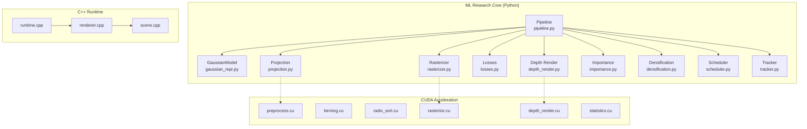

# 🏗️ Adaptive 3DGS — Khung Dự Án Đã Tạo

## Tổng quan

Đã tạo xong **toàn bộ khung cơ bản (basic framework)** cho dự án **Adaptive 3D Gaussian Splatting for Real-Time Online Reconstruction** theo đúng cấu trúc và nội dung trong [Project_1_Adaptive_3DGS_Advanced_ML_AI_Systems.md](file:///home/nguyen_quoc_hieu/Documents/adaptive_3dgs/Project_1_Adaptive_3DGS_Advanced_ML_AI_Systems.md).

---

## Cấu trúc thư mục

```text
adaptive-3dgs/
├── 📄 README.md                    # Mô tả dự án
├── 📄 setup.py                     # Python package setup
├── 📄 requirements.txt             # Dependencies (PyTorch, numpy, opencv, ...)
├── 📄 CMakeLists.txt               # Top-level CMake build
├── 📄 .gitignore                   # Git ignore rules
│
├── 📁 configs/                     # Configuration files
│   ├── default.yaml                # Config mặc định đầy đủ
│   ├── replica.yaml                # Overrides cho Replica dataset
│   └── tum_rgbd.yaml               # Overrides cho TUM RGB-D
│
├── 📁 research/                    # ⭐ ML Research Core (Python/PyTorch)
│   ├── __init__.py                 # Package exports
│   ├── gaussian_repr.py            # GaussianModel: positions, covariance, SH, states
│   ├── projection.py               # Differentiable 3D→2D projection (Jacobian)
│   ├── rasterizer.py               # Python reference rasterizer (tiling + alpha compositing)
│   ├── losses.py                   # L1 color/depth, normal, robust, compact, temporal losses
│   ├── depth_render.py             # RTG-SLAM style surface-aware depth rendering
│   ├── importance.py               # Continuous Gaussian importance scoring + tier classification
│   ├── densification.py            # Error-driven Gaussian addition & pruning
│   ├── scheduler.py                # Budget-aware GPU scheduler (knapsack optimization)
│   ├── tracker.py                  # ICP camera tracker stub
│   └── pipeline.py                 # OnlineReconstructionPipeline (ties everything together)
│
├── 📁 cuda/                        # CUDA Acceleration Layer
│   ├── CMakeLists.txt              # CUDA build config
│   ├── preprocess.cu               # Gaussian projection kernel
│   ├── binning.cu                  # Tile binning kernel
│   ├── radix_sort.cu               # CUB radix sort kernel
│   ├── rasterize.cu                # Tile rasterization + alpha compositing + early termination
│   ├── depth_render.cu             # Surface-aware depth rendering kernel
│   └── statistics.cu               # Per-Gaussian statistics collection kernel
│
├── 📁 cpp/                         # C++ Runtime Layer
│   ├── CMakeLists.txt              # C++ build config
│   ├── scene.cpp / scene.h         # Scene management
│   ├── renderer.cpp / renderer.h   # C++ renderer
│   └── runtime.cpp / runtime.h     # Main loop / runtime
│
├── 📁 datasets/                    # Dataset Loaders
│   ├── __init__.py
│   ├── base_dataset.py             # Base RGB-D dataset interface
│   ├── replica_dataset.py          # Replica dataset loader
│   └── tum_dataset.py              # TUM RGB-D dataset loader
│
├── 📁 viewer/                      # Real-Time Viewer
│   ├── __init__.py
│   └── opengl_viewer.py            # OpenGL viewer + WASD camera controller
│
├── 📁 benchmarks/                  # Benchmarking & Evaluation
│   ├── benchmark_render.py         # Rendering speed benchmark
│   ├── benchmark_pipeline.py       # Full pipeline benchmark
│   └── evaluate_metrics.py         # PSNR, SSIM, LPIPS, depth L1, AbsRel, ...
│
├── 📁 scripts/                     # Utility Scripts
│   ├── download_replica.sh         # Download Replica dataset
│   ├── download_tum.sh             # Download TUM RGB-D dataset
│   ├── run_pipeline.py             # Main entry point
│   └── visualize_gaussians.py      # Visualize Gaussian point cloud
│
├── 📁 tests/                       # Unit Tests
│   ├── __init__.py
│   ├── test_gaussian_repr.py       # Test Gaussian representation
│   ├── test_projection.py          # Test projection math
│   ├── test_losses.py              # Test loss functions
│   └── test_rasterizer.py          # Test rasterizer
│
├── 📁 docs/                        # Documentation
│   ├── ARCHITECTURE.md             # Architecture overview
│   └── GETTING_STARTED.md          # Setup guide
│
└── 📁 notebooks/                   # Research Notebooks (existing)
    └── 00_math_3dgs.ipynb          # Math foundations
```

---

## Mapping với Development Roadmap

| Phase | Nội dung | Files liên quan | Trạng thái |
|:---:|---|---|:---:|
| **0** | Study 3DGS + RTG-SLAM math | `notebooks/00_math_3dgs.ipynb` | ✅ Đã có notebook |
| **1** | Static Gaussian renderer | `research/gaussian_repr.py`, `projection.py`, `rasterizer.py` | 🔲 Stub sẵn sàng |
| **2** | RGB-D loss + depth rendering | `research/losses.py`, `depth_render.py` | 🔲 Stub sẵn sàng |
| **3** | Online Gaussian addition | `research/densification.py` | 🔲 Stub sẵn sàng |
| **4** | Baseline RTG-SLAM policy | `research/pipeline.py`, `tracker.py` | 🔲 Stub sẵn sàng |
| **5** | Continuous importance / adaptive | `research/importance.py`, `scheduler.py` | 🔲 Stub sẵn sàng |
| **6** | CUDA acceleration | `cuda/*.cu` | 🔲 Stub sẵn sàng |
| **7** | Budget scheduler + LOD | `research/scheduler.py` | 🔲 Stub sẵn sàng |
| **8** | Viewer + packaging | `viewer/opengl_viewer.py` | 🔲 Stub sẵn sàng |
| **9** | Evaluation | `benchmarks/evaluate_metrics.py` | 🔲 Stub sẵn sàng |

---

## Kiến trúc module theo doc



---

## Bước tiếp theo được đề xuất

> [!IMPORTANT]
> Tất cả file đều là **stub có cấu trúc hoàn chỉnh** với interfaces, type hints, docstrings và `TODO` markers. Bước tiếp theo là implement theo thứ tự ưu tiên trong roadmap.

1. **Phase 1** — Implement `gaussian_repr.py` đầy đủ (đặc biệt `build_covariance()`) và `projection.py`, sau đó viết `rasterizer.py` để render được scene offline
2. **Phase 2** — Implement `losses.py` (color + depth L1) và `depth_render.py` (ray-plane intersection)
3. Chạy unit tests trong `tests/` để verify từng module
4. Download dataset bằng `scripts/download_replica.sh` để có dữ liệu test
